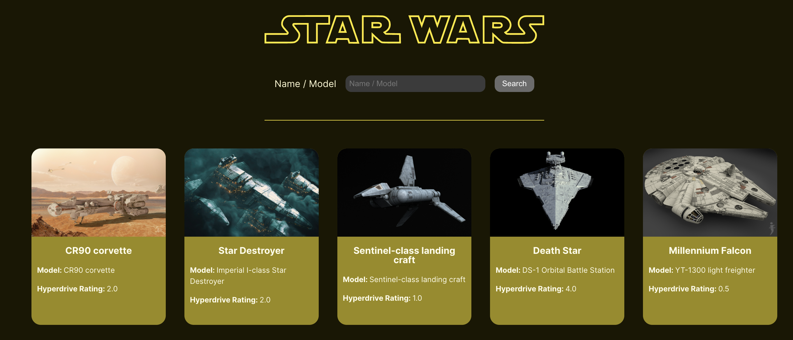
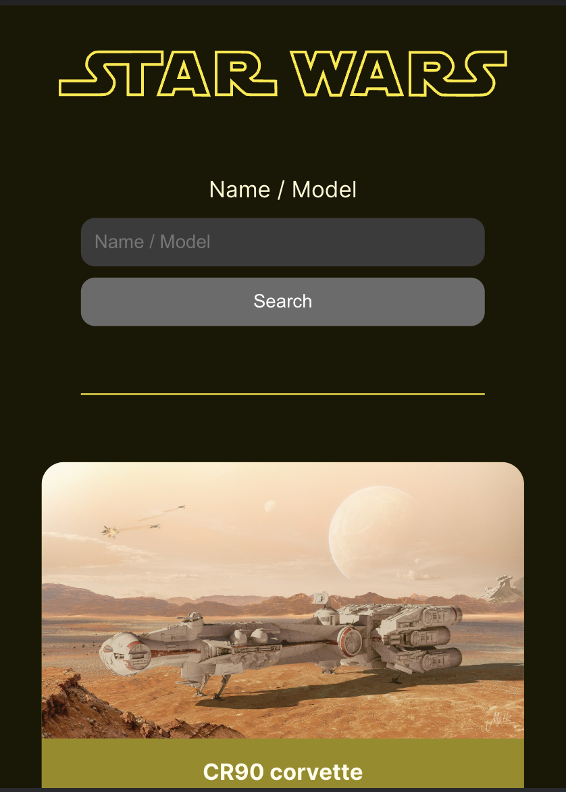
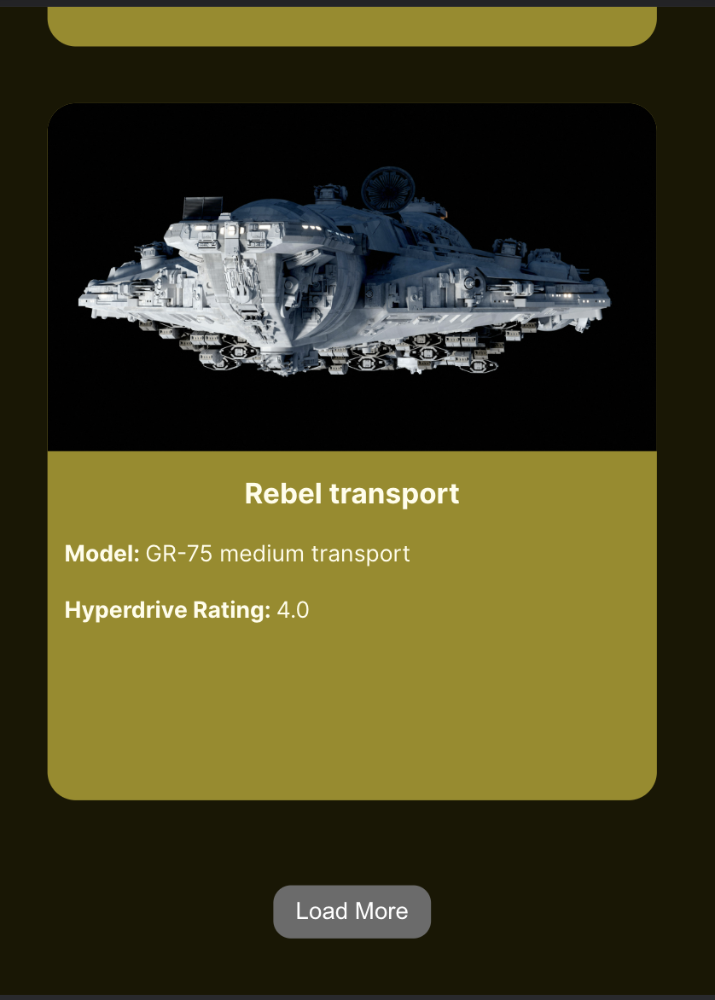

# FMSS Bilişim & Patika Frontend Practicum Final Project

This is a solution to the FMSS Bilişim & Patika frontend practicum final case.

## Getting Started
This project is created by Vite.js,

To get started with this project, follow these steps:

1. Clone the repository to your local machine.
2. Install the dependencies by running "npm install" in the project directory.
3. Start the development server by running "npm run dev".
4. Open a web browser and navigate to http://localhost:5173.

## Table of contents

- [Overview](#overview)
  - [The challenge](#the-challenge)
  - [Screenshot](#screenshot)
  - [Links](#links)
- [My process](#my-process)
  - [Built with](#built-with)
  - [What I learned](#what-i-learned)
  - [Useful resources](#useful-resources)
- [Author](#author)
- [Acknowledgments](#acknowledgments)

## Overview

### Technologies to be used

- React.js
- Axios
- Router

### Features

- Listing starships
- Search among Starships
- Read details of a specific starship
- Load more starships with a load more button

### Case Detail

- List starships by using Star Wars API
- Starship items should include name, model and hyperdrive_rating
- Users can search starships by its name or model through the API, using a single input above
- Users can click on any item and go to a detail page that includes passengers, max_atmosphering_speed, manufacturer, crew and cargo_capacity in addition to name and model
- Users can go back to home page from detail page

### Screenshot

### Links

- Solution URL: [https://github.com/YusufAkilevi/FMSS-Final-Project-Starwars-App](https://github.com/YusufAkilevi/FMSS-Final-Project-Starwars-App)

## My process

### Built with

- Semantic HTML5 markup
- Flexbox
- CSS Grid
- Desktop-first workflow
- JavaScript
- React.js
- Axios
- Router

### What I learned

I learned about components, props, state, and how to manage stateful data within a React application. While creating routes with router, I learned how to use React Router to handle client-side routing within a single-page application. I learned how to define routes, handle navigation, and pass parameters between routes. While fetching data with axios,I learned how to use Axios to make HTTP requests from within a React application. I learned how to handle responses, error states, and asynchronous behavior. Through API Integration, I learned how to integrate with an external API to fetch data and display it within a React application. I learned about data modeling, parsing responses, and handling errors. Also, I gained experience with styling a React application using CSS. I learned how to use CSS classes, selectors, and styling rules to create a consistent look and feel across the application.

Overall, this project helped me build my skills with React.js, React Router, and Axios, as well as giving me experience with integrating with an external API and styling a React application.

### Contacts

- Linkedin - [@YusufAkilevi](https://www.linkedin.com/in/yusufakilevi/)
- GitHub - [@YusufAkilevi](https://github.com/YusufAkilevi)
